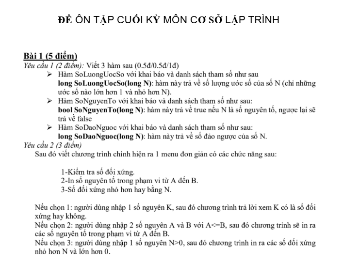
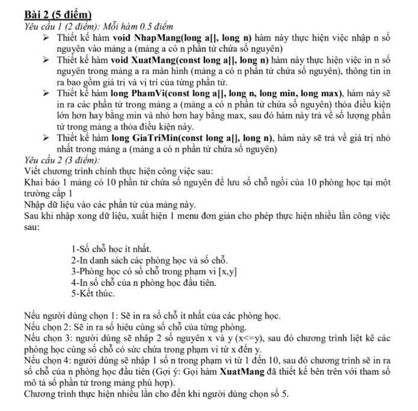

## Giải đề cho bài Đề mẫu cuối kì
[Link đề](https://docs.google.com/document/d/1x0-Qhz0Yjw0FLPwswO5Py9hdifUKBKvI/edit?usp=sharing&ouid=101370699161385641768&rtpof=true&sd=true)

### Bài giải

#### Câu 1:

```cpp
#include <iostream>
#include <iomanip>
using namespace std;

double S(int n) {
    double s = 0;
    for (int i = 1; i <= n; i++) {
        if (i == 1 || (i % 2 == 0)) {
            s += 1.0 / (2 * i + 1);
        } else {
            s -= 1.0 / (2 * i + 1);
        }
    }
    return s;
}

int ChuSoNhoNhat(long long n) {
    int min = 10; 
    while (n != 0) {
        int cs = n % 10;
        if (cs < min) {
            min = cs;
        }
        n /= 10;
    };
    return min;
}

int main() {
    char key;
    do {
        system("cls");
        cout << "1. Tim chu so lon nhat trong mot so nguyen" << endl;
        cout << "2. Tinh S(n) = 1/3 + 1/5 -1/7 ... + 1/(2n+1)" << endl;
        do {
            cout << "Chon 1 hoac 2: ";
            cin >> key;
        } while (key != '1' && key != '2');

        switch (key) {
            case '1': {
                long long n;
                cout << "TIM CHU SO LON NHAT TRONG MOT SO NGUYEN" << endl;
                cout << "Nhap so nguyen n: ";
                cin >> n;
                cout << "Chu so nho nhat trong " << n << " la: " << ChuSoNhoNhat(n) << endl;
                break;
            }
            case '2': {
                cout << "Tinh S(n) = 1/3 + 1/5 -1/7 ... + 1/(2n+1)" << endl;
                int n;
                cout << "Nhap n: ";
                cin >> n;
                cout << "S(" << n << ") = " << fixed << setprecision(6) << S(n) << endl;
                break;
            }
        }
        cout << "Tiep tuc (Nhan Y de tiep tuc): ";
        cin >> key;
    } while (key =='y' || key =='Y');
    system("pause");
    return 0;
}
```

#### Câu 2


```cpp
#include <iostream>
#include <iomanip>
#include <ctime>
using namespace std;

const int MAX = 100;

int randomInt(int from, int to) {
    return from + rand() % (to - from + 1);
}

void nhapMang(int a[], int n) {
    for (int i = 0; i < n; i++) {
        a[i] = randomInt(20, 40);
    }
}

void inMang(int a[], int n) {
    for (int i = 0; i < n; i++) {
        cout << a[i] << " ";
    }
}

void inChanLonNhatNhoNhat(int a[], int n) {
    int maxEven = -1;
    int minEven = 99999;
    for (int i = 0; i < n; i++) {
        if (a[i] % 2 == 0) {
            if (a[i] > maxEven) {
                maxEven = a[i];
            }
            if (a[i] < minEven) {
                minEven = a[i];
            }
        }
    }

    if (maxEven == -1) {
        cout << "\nKhong co so chan trong mang." << endl;
    }
    else
        cout << "\nSo chan lon nhat: " << maxEven << endl;

    if (minEven == 99999) {
        cout << "Khong co so chan trong mang." << endl;
    }
    else
        cout << "So chan nho nhat: " << minEven << endl;
}

void sapXep(int a[], int n) {
    for (int i = 0; i < n - 1; i++) {
        for (int j = i + 1; j < n; j++) {
            if (a[i] % 2 == 0 && a[j] % 2 != 0) {
                a[i] = a[i] + a[j];
                a[j] = a[i] - a[j];
                a[i] = a[i] - a[j];
            }
            else if (a[i] % 2 == 0 && a[j] % 2 == 0 && a[i] > a[j]) {
                a[i] = a[i] + a[j];
                a[j] = a[i] - a[j];
                a[i] = a[i] - a[j];
            }
        }
    }
}

int main() {
    srand((int)time(NULL));
    int n;
    int a[MAX];
    cout << "Nhap so phan tu cua mang: ";
    cin >> n;

    nhapMang(a, n);

    // In mang
    inMang(a, n);

    // in ra so chan lon nhat va nho nhat
    inChanLonNhatNhoNhat(a, n);

    // Le ben trai chan ben phai va tang dan
    sapXep(a, n);

    // In mang
    inMang(a, n);

    system("pause");
    return 0;
}
```

Hoặc tham khảo câu 2c của bạn Kim Oanh việc chuyển mảng lẻ sang trái, mảng chẳn sang phải và tăng dần:

```cpp
#include <iostream>
#include <vector>
using namespace std;

int main() {
    int n; cin >> n;
    vector<int> a(n);
    for (int i = 0; i < n; i++) cin >> a[i];

    int k = 0; 

    for (int i = 0; i < n; i++) {
        int tmp = a[i];
        if (tmp % 2 != 0) { //lẻ
            int j = i - 1;

            while (j >= k) { // sang trái
                a[j + 1] = a[j];
                j--;
            }

            // chèn vào vị trí
            j = k - 1;
            while (j >= 0 && a[j] > tmp) {
                a[j + 1] = a[j];
                j--;
            }

            a[j + 1] = tmp;
            k++;
        }

        else { //chẵn
            int j = i - 1;

            // chèn vào vị trí
            while (j >= k && a[j] > tmp) {
                a[j + 1] = a[j];
                j--;
            }

            a[j + 1] = tmp;
        }
    }

    for(auto x : a) cout<<x<<" ";
    cout<<endl;

    return 0;
}
```

Tham khảo về Rand/Srand: [Link](https://blog.28tech.com.vn/c-sinh-so-ngau-nhien-trong-c-rand-va-srand)

Tham khảo về các thuật toán sắp sếp: [Link](https://viblo.asia/p/cac-thuat-toan-sap-xep-co-ban-Eb85ooNO52G)


## Bài tập về nhà (24/12 tối 20h nộp)


