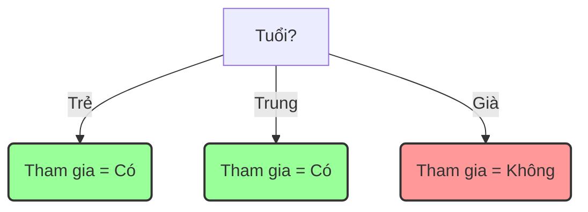

### **Bài tập 1: Khai phá luật kết hợp (Apriori)**

**Yêu cầu:**
a. Với ngưỡng `min_sup = 3`, hãy xác định tất cả các frequent itemsets bằng thuật toán Apriori.
b. Từ L3 (nếu có), sinh ra các luật kết hợp thỏa `min_conf = 70%`.

**a. Xác định Frequent Itemsets (Thuật toán Apriori)**

Dựa trên quy trình của thuật toán Apriori (*Chương 3 - Slide 13-16*).
Tổng số giao dịch (Total Transactions) = 6.
`min_sup` (độ hỗ trợ tối thiểu) = 3.

**Vòng 1: Tìm tập phổ biến 1-item (L1)**

1.  **Tạo tập ứng viên C1:** Liệt kê tất cả các item duy nhất.
    `C1 = {{Sữa}, {Bánh mì}, {Trứng}, {Nước ngọt}}`
2.  **Đếm Support cho từng ứng viên:**
    *   Support({Sữa}) = 4 (xuất hiện trong TID 1, 2, 4, 5)
    *   Support({Bánh mì}) = 5 (xuất hiện trong TID 1, 2, 3, 5, 6)
    *   Support({Trứng}) = 4 (xuất hiện trong TID 1, 3, 4, 5)
    *   Support({Nước ngọt}) = 1 (xuất hiện trong TID 6)
3.  **Chọn tập phổ biến L1:** So sánh Support với `min_sup`.
    *   Support({Nước ngọt}) = 1 < 3  → Loại.
    *   **L1 = `{{Sữa}, {Bánh mì}, {Trứng}}`**

**Vòng 2: Tìm tập phổ biến 2-item (L2)**

1.  **Tạo tập ứng viên C2 (từ L1):** Kết hợp các item trong L1.
    `C2 = {{Sữa, Bánh mì}, {Sữa, Trứng}, {Bánh mì, Trứng}}`
2.  **Đếm Support cho từng ứng viên:**
    *   Support({Sữa, Bánh mì}) = 3 (TID 1, 2, 5)
    *   Support({Sữa, Trứng}) = 3 (TID 1, 4, 5)
    *   Support({Bánh mì, Trứng}) = 3 (TID 1, 3, 5)
3.  **Chọn tập phổ biến L2:** Tất cả các ứng viên đều có Support ≥ 3.
    *   **L2 = `{{Sữa, Bánh mì}, {Sữa, Trứng}, {Bánh mì, Trứng}}`**

**Vòng 3: Tìm tập phổ biến 3-item (L3)**

1.  **Tạo tập ứng viên C3 (từ L2):** Kết hợp các itemset trong L2 có chung item đầu tiên.
    *   Kết hợp `{Sữa, Bánh mì}` và `{Sữa, Trứng}` → `{Sữa, Bánh mì, Trứng}`.
    *   `C3 = {{Sữa, Bánh mì, Trứng}}`
2.  **Đếm Support cho ứng viên:**
    *   Support({Sữa, Bánh mì, Trứng}) = 2 (TID 1, 5)
3.  **Chọn tập phổ biến L3:**
    *   Support({Sữa, Bánh mì, Trứng}) = 2 < 3 → Loại.
    *   **L3 = `{}` (Tập rỗng)**

Thuật toán dừng lại vì không thể tạo C4 từ L3 rỗng.

**Kết luận phần a:** Các tập phổ biến (frequent itemsets) là:
*   **L1 = `{{Sữa}, {Bánh mì}, {Trứng}}`**
*   **L2 = `{{Sữa, Bánh mì}, {Sữa, Trứng}, {Bánh mì, Trứng}}`**

**b. Sinh luật kết hợp từ L3**

Vì tập L3 là tập rỗng, **không thể sinh ra bất kỳ luật kết hợp nào từ L3**.

*(Ghi chú: Nếu đề bài cho phép sinh luật từ tập phổ biến lớn nhất tìm được (L2), chúng ta sẽ thực hiện như sau)*
**Sinh luật từ L2:**
Công thức: `Confidence(X → Y) = Support(X U Y) / Support(X)`

1.  **Từ itemset `{Sữa, Bánh mì}` (Support = 3):**
    *   `{Sữa} → {Bánh mì}`: Conf = Sup({Sữa, Bánh mì})/Sup({Sữa}) = 3/4 = 75%. (75% ≥ 70% → **Luật hợp lệ**)
    *   `{Bánh mì} → {Sữa}`: Conf = Sup({Sữa, Bánh mì})/Sup({Bánh mì}) = 3/5 = 60%. (60% < 70% → Loại)
2.  **Từ itemset `{Sữa, Trứng}` (Support = 3):**
    *   `{Sữa} → {Trứng}`: Conf = Sup({Sữa, Trứng})/Sup({Sữa}) = 3/4 = 75%. (75% ≥ 70% → **Luật hợp lệ**)
    *   `{Trứng} → {Sữa}`: Conf = Sup({Sữa, Trứng})/Sup({Trứng}) = 3/4 = 75%. (75% ≥ 70% → **Luật hợp lệ**)
3.  **Từ itemset `{Bánh mì, Trứng}` (Support = 3):**
    *   `{Bánh mì} → {Trứng}`: Conf = Sup({Bánh mì, Trứng})/Sup({Bánh mì}) = 3/5 = 60%. (60% < 70% → Loại)
    *   `{Trứng} → {Bánh mì}`: Conf = Sup({Bánh mì, Trứng})/Sup({Trứng}) = 3/4 = 75%. (75% ≥ 70% → **Luật hợp lệ**)

---

### **Đề bài Apriori phức tạp**

**Cho tập giao dịch của một cửa hàng tiện lợi như sau:**

| TID | Các mặt hàng đã mua |
| :-- | :--- |
| 1 | {Sữa, Bánh mì, Trứng} |
| 2 | {Sữa, Bánh mì, Trứng, Bơ} |
| 3 | {Sữa, Bánh mì, Trứng} |
| 4 | {Sữa, Bơ, Phô mai} |
| 5 | {Sữa, Bơ} |
| 6 | {Bánh mì, Bơ} |
| 7 | {Bánh mì, Phô mai} |
| 8 | {Sữa, Trứng} |
| 9 | {Bánh mì, Nước ngọt} |

**Yêu cầu:**

a. Với ngưỡng hỗ trợ tối thiểu **`min_sup = 3`**, hãy xác định tất cả các tập mục phổ biến (frequent itemsets) bằng thuật toán Apriori. Trình bày rõ các bước sinh tập ứng viên (Ck) và chọn tập phổ biến (Lk).

b. Từ tập phổ biến `L3` tìm được ở câu a, hãy sinh ra tất cả các luật kết hợp (association rules) có thể có.

c. Với ngưỡng tin cậy tối thiểu **`min_conf = 75%`**, hãy xác định các luật kết hợp hợp lệ từ các luật đã sinh ở câu b.

---

### **Bài giải chi tiết**

**a. Xác định Frequent Itemsets (min_sup = 3)**

Tổng số giao dịch (Total Transactions) = 9.

**Vòng 1: Tìm tập phổ biến 1-item (L1)**

1.  **Sinh tập ứng viên C1 (Candidate 1-itemset):**
    `C1 = {{Sữa}, {Bánh mì}, {Trứng}, {Bơ}, {Phô mai}, {Nước ngọt}}`

2.  **Đếm độ hỗ trợ (Support Count) cho các ứng viên trong C1:**
    *   Support({Sữa}) = 6
    *   Support({Bánh mì}) = 5
    *   Support({Trứng}) = 4
    *   Support({Bơ}) = 4
    *   Support({Phô mai}) = 2
    *   Support({Nước ngọt}) = 1

3.  **Chọn tập phổ biến L1 (Frequent 1-itemset):** Loại bỏ các itemset có support < 3.
    *   Loại {Phô mai} (Support=2) và {Nước ngọt} (Support=1).
    *   **L1 = `{{Sữa}, {Bánh mì}, {Trứng}, {Bơ}}`**

**Vòng 2: Tìm tập phổ biến 2-item (L2)**

1.  **Sinh tập ứng viên C2 (từ L1):** Kết hợp các item trong L1 với nhau.
    `C2 = {{Sữa, Bánh mì}, {Sữa, Trứng}, {Sữa, Bơ}, {Bánh mì, Trứng}, {Bánh mì, Bơ}, {Trứng, Bơ}}`

2.  **Đếm độ hỗ trợ cho các ứng viên trong C2:**
    *   Support({Sữa, Bánh mì}) = 3 (TID 1, 2, 3)
    *   Support({Sữa, Trứng}) = 4 (TID 1, 2, 3, 8)
    *   Support({Sữa, Bơ}) = 3 (TID 2, 4, 5)
    *   Support({Bánh mì, Trứng}) = 3 (TID 1, 2, 3)
    *   Support({Bánh mì, Bơ}) = 2 (TID 2, 6)
    *   Support({Trứng, Bơ}) = 1 (TID 2)

3.  **Chọn tập phổ biến L2:** Loại bỏ các itemset có support < 3.
    *   Loại {Bánh mì, Bơ} (Support=2) và {Trứng, Bơ} (Support=1).
    *   **L2 = `{{Sữa, Bánh mì}, {Sữa, Trứng}, {Sữa, Bơ}, {Bánh mì, Trứng}}`**

**Vòng 3: Tìm tập phổ biến 3-item (L3)**

1.  **Sinh tập ứng viên C3 (từ L2 - Join Step):** Kết hợp các itemset trong L2 có (k-2) item đầu tiên giống nhau (ở đây là 1 item).
    *   `{Sữa, Bánh mì}` và `{Sữa, Trứng}` → `{Sữa, Bánh mì, Trứng}`
    *   `{Sữa, Bánh mì}` và `{Sữa, Bơ}` → `{Sữa, Bánh mì, Bơ}`
    *   `{Sữa, Trứng}` và `{Sữa, Bơ}` → `{Sữa, Trứng, Bơ}`

    → Tập ứng viên ban đầu: `{{Sữa, Bánh mì, Trứng}, {Sữa, Bánh mì, Bơ}, {Sữa, Trứng, Bơ}}`

2.  **Cắt tỉa ứng viên C3 (Prune Step):** Kiểm tra xem tất cả các tập con 2-item của mỗi ứng viên có nằm trong L2 không.
    *   **Ứng viên `{Sữa, Bánh mì, Trứng}`:**
        *   Tập con: `{Sữa, Bánh mì}`, `{Sữa, Trứng}`, `{Bánh mì, Trứng}`.
        *   Tất cả đều có trong L2. → **Giữ lại**.
    *   **Ứng viên `{Sữa, Bánh mì, Bơ}`:**
        *   Tập con: `{Sữa, Bánh mì}`, `{Sữa, Bơ}`, `{Bánh mì, Bơ}`.
        *   `{Bánh mì, Bơ}` **không có** trong L2. → **Loại bỏ**.
    *   **Ứng viên `{Sữa, Trứng, Bơ}`:**
        *   Tập con: `{Sữa, Trứng}`, `{Sữa, Bơ}`, `{Trứng, Bơ}`.
        *   `{Trứng, Bơ}` **không có** trong L2. → **Loại bỏ**.

    → **C3 sau khi cắt tỉa = `{{Sữa, Bánh mì, Trứng}}`**

3.  **Đếm độ hỗ trợ cho các ứng viên còn lại trong C3:**
    *   Support({Sữa, Bánh mì, Trứng}) = 3 (TID 1, 2, 3)

4.  **Chọn tập phổ biến L3:**
    *   Support({Sữa, Bánh mì, Trứng}) = 3 ≥ 3.
    *   **L3 = `{{Sữa, Bánh mì, Trứng}}`**

**Vòng 4: Tìm tập phổ biến 4-item (L4)**
*   Vì L3 chỉ có một phần tử, không thể thực hiện bước kết hợp (join) để tạo ra C4.
*   Thuật toán dừng lại.

**Kết luận phần a:** Các tập phổ biến tìm được là **L1, L2, và L3**.

---

**b. Sinh các luật kết hợp từ L3**

Từ tập phổ biến `{Sữa, Bánh mì, Trứng}`, ta có thể sinh ra các luật sau:

1.  `{Sữa, Bánh mì} → {Trứng}`
2.  `{Sữa, Trứng} → {Bánh mì}`
3.  `{Bánh mì, Trứng} → {Sữa}`
4.  `{Sữa} → {Bánh mì, Trứng}`
5.  `{Bánh mì} → {Sữa, Trứng}`
6.  `{Trứng} → {Sữa, Bánh mì}`

---

**c. Xác định các luật kết hợp hợp lệ (min_conf = 75%)**

Ta sử dụng công thức: `Confidence(X → Y) = Support(X U Y) / Support(X)`
`Support({Sữa, Bánh mì, Trứng})` = 3.

1.  **Luật `{Sữa, Bánh mì} → {Trứng}`:**
    *   `Confidence = Support({Sữa, Bánh mì, Trứng}) / Support({Sữa, Bánh mì})`
    *   `= 3 / 3 = 100%`
    *   100% ≥ 75% → **Luật hợp lệ.**

2.  **Luật `{Sữa, Trứng} → {Bánh mì}`:**
    *   `Confidence = Support({Sữa, Bánh mì, Trứng}) / Support({Sữa, Trứng})`
    *   `= 3 / 4 = 75%`
    *   75% ≥ 75% → **Luật hợp lệ.**

3.  **Luật `{Bánh mì, Trứng} → {Sữa}`:**
    *   `Confidence = Support({Sữa, Bánh mì, Trứng}) / Support({Bánh mì, Trứng})`
    *   `= 3 / 3 = 100%`
    *   100% ≥ 75% → **Luật hợp lệ.**

4.  **Luật `{Sữa} → {Bánh mì, Trứng}`:**
    *   `Confidence = Support({Sữa, Bánh mì, Trứng}) / Support({Sữa})`
    *   `= 3 / 6 = 50%`
    *   50% < 75% → Luật không hợp lệ.

5.  **Luật `{Bánh mì} → {Sữa, Trứng}`:**
    *   `Confidence = Support({Sữa, Bánh mì, Trứng}) / Support({Bánh mì})`
    *   `= 3 / 5 = 60%`
    *   60% < 75% → Luật không hợp lệ.

6.  **Luật `{Trứng} → {Sữa, Bánh mì}`:**
    *   `Confidence = Support({Sữa, Bánh mì, Trứng}) / Support({Trứng})`
    *   `= 3 / 4 = 75%`
    *   75% ≥ 75% → **Luật hợp lệ.**

**Kết luận phần c:** Các luật kết hợp hợp lệ với `min_conf = 75%` là:
*   `{Sữa, Bánh mì} → {Trứng}` (Conf: 100%)
*   `{Sữa, Trứng} → {Bánh mì}` (Conf: 75%)
*   `{Bánh mì, Trứng} → {Sữa}` (Conf: 100%)
*   `{Trứng} → {Sữa, Bánh mì}` (Conf: 75%)
---

### **Bài tập 2: Cây quyết định (ID3)**

**Yêu cầu:**
a. Tính Entropy(S) và Information Gain của các thuộc tính: `Tuổi` và `Có việc làm`. Thuộc tính nào được chọn làm nút gốc? Giải thích.
b. Vẽ một phần cây quyết định dựa trên kết quả ở trên.

**a. Tính Entropy và Information Gain**

Dựa trên công thức và quy trình của thuật toán ID3 (*Chương 4 - Slide 14-16*).
Tổng số mẫu (S) = 8.
Lớp quyết định "Tham gia?": 5 'Có', 3 'Không'.

**Bước 1: Tính Entropy của toàn bộ tập dữ liệu (Entropy(S))**
*   `P(Có) = 5/8`
*   `P(Không) = 3/8`
*   `Entropy(S) = - (5/8) * log2(5/8) - (3/8) * log2(3/8)`
    `= - (0.625 * -0.678) - (0.375 * -1.415) = 0.424 + 0.531`
    `= **0.954**`

**Bước 2: Tính Information Gain cho thuộc tính "Tuổi"**
*   **Nhánh Tuổi = 'Trẻ' (3 mẫu):** {Có, Có, Có} → 3 Có, 0 Không.
    `Entropy(Trẻ) = - (3/3) * log2(3/3) - 0 = 0`
*   **Nhánh Tuổi = 'Trung' (2 mẫu):** {Có, Có} → 2 Có, 0 Không.
    `Entropy(Trung) = - (2/2) * log2(2/2) - 0 = 0`
*   **Nhánh Tuổi = 'Già' (3 mẫu):** {Không, Không, Không} → 0 Có, 3 Không.
    `Entropy(Già) = 0 - (3/3) * log2(3/3) = 0`
*   **Gain(S, Tuổi):**
    `Gain(S, Tuổi) = Entropy(S) - [ (3/8)*Entropy(Trẻ) + (2/8)*Entropy(Trung) + (3/8)*Entropy(Già) ]`
    `= 0.954 - [ (3/8)*0 + (2/8)*0 + (3/8)*0 ]`
    `= **0.954**`

**Bước 3: Tính Information Gain cho thuộc tính "Có việc làm"**
*   **Nhánh Có việc làm = 'Có' (5 mẫu):** {Có, Không, Có, Có, Không} → 3 Có, 2 Không.
    `Entropy(Có việc) = - (3/5)*log2(3/5) - (2/5)*log2(2/5) ≈ 0.971`
*   **Nhánh Có việc làm = 'Không' (3 mẫu):** {Có, Không, Có} → 2 Có, 1 Không.
    `Entropy(Không việc) = - (2/3)*log2(2/3) - (1/3)*log2(1/3) ≈ 0.918`
*   **Gain(S, Có việc làm):**
    `Gain(S, Có việc làm) = Entropy(S) - [ (5/8)*Entropy(Có việc) + (3/8)*Entropy(Không việc) ]`
    `= 0.954 - [ (5/8)*0.971 + (3/8)*0.918 ]`
    `= 0.954 - [ 0.607 + 0.344 ] = 0.954 - 0.951`
    `= **0.003**`

**Kết luận và Giải thích:**
*   `Gain(S, Tuổi) = 0.954`
*   `Gain(S, Có việc làm) = 0.003`
So sánh hai giá trị, ta thấy `Gain(S, Tuổi)` cao hơn hẳn. Do đó, thuộc tính **"Tuổi"** được chọn làm nút gốc.
**Giải thích:** Thuộc tính "Tuổi" được chọn vì nó mang lại lượng thông tin lớn nhất, giúp giảm độ "hỗn loạn" (entropy) của tập dữ liệu một cách hiệu quả nhất, tạo ra các nhánh con "thuần khiết" nhất.

**b. Vẽ cây quyết định**

Dựa trên kết quả trên, cây quyết định sẽ bắt đầu như sau:

*   **Gốc:** Tuổi?
*   **Nhánh 1:** Nếu Tuổi = Trẻ, kết quả là **Có** (vì tất cả 3 trường hợp đều là 'Có'). Đây là nút lá.
*   **Nhánh 2:** Nếu Tuổi = Trung, kết quả là **Có** (vì tất cả 2 trường hợp đều là 'Có'). Đây là nút lá.
*   **Nhánh 3:** Nếu Tuổi = Già, kết quả là **Không** (vì tất cả 3 trường hợp đều là 'Không'). Đây là nút lá.

Cây quyết định được xây dựng hoàn chỉnh chỉ sau một lần chia.

---

### **Bài tập 3: Naive Bayes**

**Yêu cầu:**
a. Tính các xác suất cần thiết theo mô hình Naive Bayes.
b. Dự đoán nhãn cho trường hợp mới: X = (Thời tiết = Mưa, Có xe máy = Có, Khoảng cách = Xa).

**a. Tính các xác suất cần thiết**

Dựa trên *Chương 4 - Slide 52-55*.
Tổng số mẫu = 6.
Lớp quyết định "Đi bằng ô tô?": 4 'Có', 2 'Không'.

**1. Xác suất tiên nghiệm P(C):**
*   `P(Đi bằng ô tô? = Có) = 4/6 = 2/3`
*   `P(Đi bằng ô tô? = Không) = 2/6 = 1/3`

**2. Xác suất có điều kiện P(Xi | C):**
*   **Với lớp 'Có' (4 mẫu):**
    *   `P(Thời tiết=Mưa | Có) = 1/4`
    *   `P(Thời tiết=Nắng | Có) = 3/4`
    *   `P(Có xe máy=Có | Có) = 4/4 = 1`
    *   `P(Có xe máy=Không | Có) = 0/4 = 0`
    *   `P(Khoảng cách=Xa | Có) = 3/4`
    *   `P(Khoảng cách=Gần | Có) = 1/4`
*   **Với lớp 'Không' (2 mẫu):**
    *   `P(Thời tiết=Mưa | Không) = 1/2`
    *   `P(Thời tiết=Nắng | Không) = 1/2`
    *   `P(Có xe máy=Có | Không) = 0/2 = 0`  *(Đây là trường hợp tần suất bằng 0)*
    *   `P(Có xe máy=Không | Không) = 2/2 = 1`
    *   `P(Khoảng cách=Xa | Không) = 1/2`
    *   `P(Khoảng cách=Gần | Không) = 1/2`

**b. Dự đoán cho trường hợp X = (Mưa, Có, Xa)**

Áp dụng công thức Bayes: `P(C | X) ∝ P(C) * P(Thời tiết | C) * P(Có xe máy | C) * P(Khoảng cách | C)`

*   **Tính điểm cho lớp 'Có':**
    `Score(Có) = P(Có) * P(Mưa | Có) * P(Có xe máy=Có | Có) * P(Xa | Có)`
    `= (4/6) * (1/4) * (4/4) * (3/4)`
    `= (2/3) * (1/4) * 1 * (3/4) = 6/48 = 1/8 = **0.125**`

*   **Tính điểm cho lớp 'Không':**
    `Score(Không) = P(Không) * P(Mưa | Không) * P(Có xe máy=Có | Không) * P(Xa | Không)`
    `= (2/6) * (1/2) * (0/2) * (1/2)`
    `= (1/3) * (1/2) * 0 * (1/2) = **0**`

**So sánh và kết luận:**
*   `Score(Có) = 0.125`
*   `Score(Không) = 0`

Vì `Score(Có) > Score(Không)`, mô hình Naive Bayes dự đoán nhãn cho trường hợp X là **"Có"**.

---

### **Bài tập 4: Phân cụm K-Means**

**Yêu cầu:**
a. Phân cụm các điểm theo khoảng cách Euclidean ở vòng lặp đầu tiên.
b. Cập nhật lại tâm cụm mới cho mỗi cụm.

Dữ liệu: P1(1,1), P2(2,1), P3(4,3), P4(5,4), P5(3,2).
Tâm cụm ban đầu: `Tâm 1 = P1(1,1)`, `Tâm 2 = P4(5,4)`.

**a. Phân cụm các điểm (Bước gán cụm - Assignment)**

Ta tính khoảng cách Euclidean từ mỗi điểm đến hai tâm cụm và gán điểm đó vào cụm có tâm gần hơn.
Công thức: `Distance = sqrt( (x2-x1)² + (y2-y1)² )`

*   **Điểm P1(1,1):**
    *   Khoảng cách đến Tâm 1(1,1) = 0.  → **Thuộc Cụm 1**

*   **Điểm P2(2,1):**
    *   Khoảng cách đến Tâm 1(1,1) = `sqrt((2-1)² + (1-1)²) = 1`
    *   Khoảng cách đến Tâm 2(5,4) = `sqrt((2-5)² + (1-4)²) = sqrt(9 + 9) = sqrt(18) ≈ 4.24`
    *   1 < 4.24 → **Thuộc Cụm 1**

*   **Điểm P3(4,3):**
    *   Khoảng cách đến Tâm 1(1,1) = `sqrt((4-1)² + (3-1)²) = sqrt(9 + 4) = sqrt(13) ≈ 3.61`
    *   Khoảng cách đến Tâm 2(5,4) = `sqrt((4-5)² + (3-4)²) = sqrt(1 + 1) = sqrt(2) ≈ 1.41`
    *   1.41 < 3.61 → **Thuộc Cụm 2**

*   **Điểm P4(5,4):**
    *   Khoảng cách đến Tâm 2(5,4) = 0.  → **Thuộc Cụm 2**

*   **Điểm P5(3,2):**
    *   Khoảng cách đến Tâm 1(1,1) = `sqrt((3-1)² + (2-1)²) = sqrt(4 + 1) = sqrt(5) ≈ 2.24`
    *   Khoảng cách đến Tâm 2(5,4) = `sqrt((3-5)² + (2-4)²) = sqrt(4 + 4) = sqrt(8) ≈ 2.83`
    *   2.24 < 2.83 → **Thuộc Cụm 1**

**Kết quả phân cụm sau vòng 1:**
*   **Cụm 1: {P1(1,1), P2(2,1), P5(3,2)}**
*   **Cụm 2: {P3(4,3), P4(5,4)}**

**b. Cập nhật lại tâm cụm (Bước cập nhật - Update)**

Tâm cụm mới được tính bằng trung bình cộng tọa độ của tất cả các điểm trong cụm đó.

*   **Tâm cụm 1 mới:**
    *   Tọa độ x = `(1 + 2 + 3) / 3 = 6 / 3 = 2`
    *   Tọa độ y = `(1 + 1 + 2) / 3 = 4 / 3 ≈ 1.33`
    *   **Tâm 1 mới = (2, 1.33)**

*   **Tâm cụm 2 mới:**
    *   Tọa độ x = `(4 + 5) / 2 = 9 / 2 = 4.5`
    *   Tọa độ y = `(3 + 4) / 2 = 7 / 2 = 3.5`
    *   **Tâm 2 mới = (4.5, 3.5)**

Vòng lặp đầu tiên của thuật toán K-Means kết thúc tại đây.